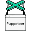

# Hi 👋, I'm Rodrigo

I'm an intern in data engineering with a strong passion for data collection and analysis, as well as process automation. I'm currently in my final year of the Electrical Engineering program with a focus on Control and Automation at Poli-USP. I'm also deepening my knowledge in data engineering through the AWS Academy's Data Engineering course.

## My Skills and Experience

-📊 **Data Collection**: I have experience in collecting data from various sources, including the web, APIs, and databases.

-☁️ **Azure Development**: I develop pipelines and solutions on the Azure platform to efficiently collect, validate, process and store data.

-🌐 **Web Scraping in JavaScript**: I use JavaScript to create web scraping scripts and extract data from websites.

-🤖 **Process Automation**: I automate tasks and processes to optimize efficiency.

-🐍 **Data Analysis with Python**: I perform exploratory data analysis with Python.

	
	
	
	
  
	

## My Interest and Passion

I have a strong interest in innovation and applying data engineering technologies to solve real-world problems. I enjoy automating processes to save time and resources, and I believe that data analysis is a powerful tool for making informed decisions.

## Contact

- **Email**: rodrigotav25@gmail.com
- **LinkedIn**: [in/rodrigomtav](https://www.linkedin.com/in/rodrigomtav/?locale=en_US)
